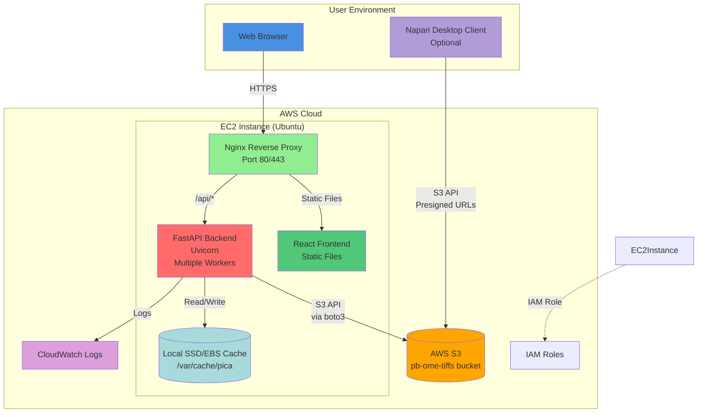
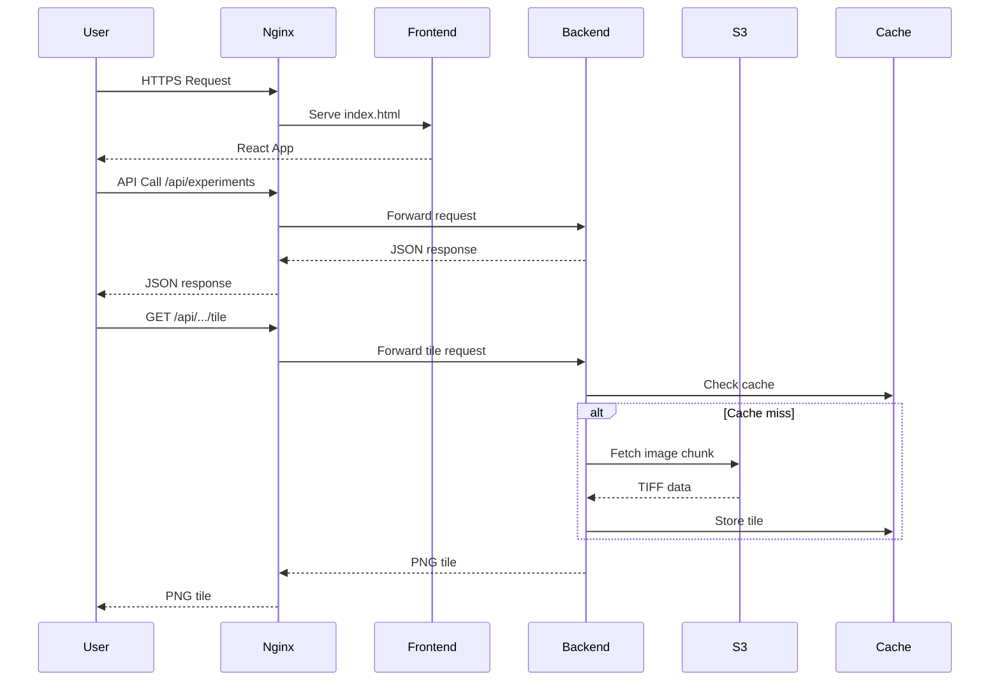
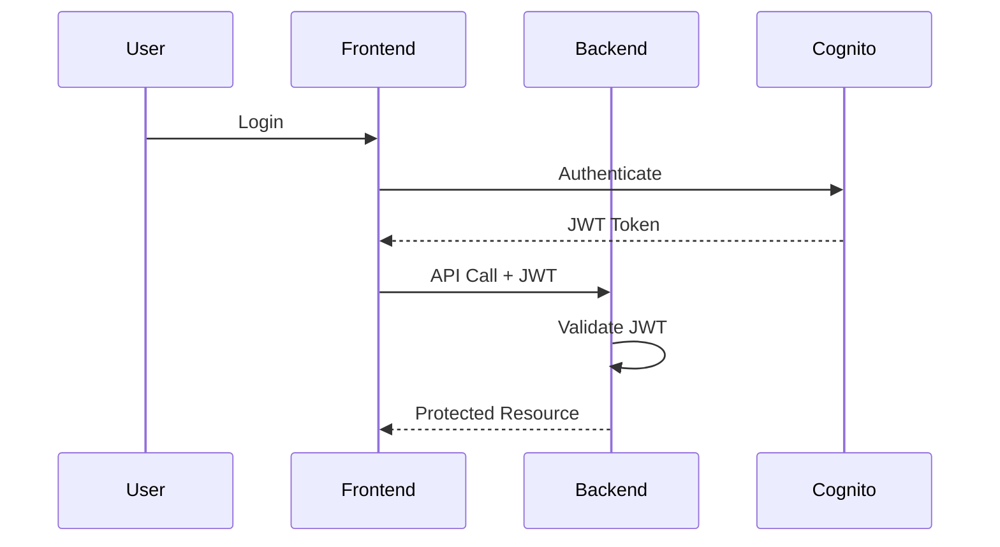
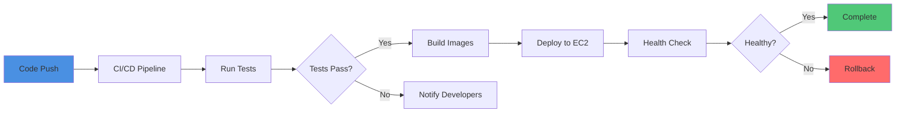
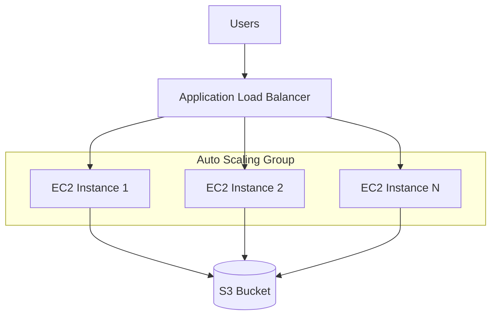

# PICA Microscopy Viewer - AWS EC2 Deployment Architecture

This document describes the architecture for production deployment on AWS EC2 (Ubuntu) with real S3 storage.

## High-Level Architecture



## Component Details

### Web Browser (Client)
- **Access**: HTTPS via public EC2 IP or domain name
- **Features**:
  - Full web UI for plate browsing
  - WebGL-based image viewer
  - Responsive design
  - Works on desktop and mobile

### Nginx Reverse Proxy
- **Purpose**:
  - Serve static frontend files
  - Reverse proxy for backend API
  - SSL/TLS termination
  - Load balancing (if multiple backend workers)
- **Configuration**:
  - Listens on ports 80 (redirect) and 443 (HTTPS)
  - Serves React build from `/var/www/pica`
  - Proxies `/api/*` to backend on port 8000
  - Gzip compression enabled
  - Static asset caching
- **SSL**: Let's Encrypt certificate (recommended)

### React Frontend (Static Build)
- **Deployment**:
  - Built with `npm run build`
  - Deployed to `/var/www/pica`
  - Served by Nginx as static files
- **Features**: Same as local dev
- **API Calls**: Proxied through Nginx to backend

### FastAPI Backend
- **Deployment**:
  - Runs as systemd service
  - Multiple Uvicorn workers (4-8 depending on CPU)
  - Gunicorn as process manager (optional)
- **Features**:
  - Tile serving with multi-scale support
  - S3 integration via boto3
  - Local SSD/EBS cache
  - CloudWatch logging
  - Health check endpoint for monitoring
- **Scaling**:
  - Vertical: Increase EC2 instance size
  - Horizontal: Multiple EC2 instances behind ALB (future)
- **Port**: 8000 (internal only, accessed via Nginx)

### AWS S3 (Production Storage)
- **Bucket**: `pb-ome-tiffs`
- **Region**: us-west-2 (configurable)
- **Access**:
  - Backend uses IAM role (no hardcoded credentials)
  - Private bucket (not public)
  - Versioning enabled (recommended)
  - Lifecycle policies for cost optimization
- **Data Structure**:
  ```
  s3://pb-ome-tiffs/
  ├── {experiment}/
  │   └── {sequence}/
  │       └── {well}/
  │           ├── image.ome.tiff
  │           ├── image.zarr/  (future)
  │           ├── processed/
  │           │   ├── nuclei.tif
  │           │   ├── actin.tif
  │           │   ├── mito_mp.tif
  │           │   └── mito_tot.tif
  │           └── masks/
  │               ├── nuclei_mask.tif
  │               ├── mito_mask.tif
  │               └── microsam_masks.tif
  ```

### Local Cache (SSD/EBS)
- **Purpose**: LRU cache for frequently accessed tiles
- **Technology**: diskcache (Python)
- **Location**: `/var/cache/pica` (dedicated EBS volume recommended)
- **Size**: 100-500 GB (based on usage patterns)
- **Eviction**: LRU with configurable max size
- **Benefits**:
  - Reduced S3 API calls (cost savings)
  - Lower latency for repeated access
  - Better performance for multi-user scenarios

### CloudWatch Integration
- **Logs**: Application logs streamed to CloudWatch
- **Metrics**: Custom metrics for monitoring
  - API request latency
  - Cache hit rate
  - S3 download times
  - Active users
- **Alarms**: Set up for critical events
  - High error rates
  - Disk space usage
  - Memory/CPU usage

### IAM Role
- **Purpose**: Secure S3 access without credentials
- **Permissions**:
  ```json
  {
    "Version": "2012-10-17",
    "Statement": [
      {
        "Effect": "Allow",
        "Action": [
          "s3:GetObject",
          "s3:ListBucket"
        ],
        "Resource": [
          "arn:aws:s3:::pb-ome-tiffs",
          "arn:aws:s3:::pb-ome-tiffs/*"
        ]
      },
      {
        "Effect": "Allow",
        "Action": [
          "logs:CreateLogGroup",
          "logs:CreateLogStream",
          "logs:PutLogEvents"
        ],
        "Resource": "arn:aws:logs:*:*:*"
      }
    ]
  }
  ```

### Napari Desktop Client (Optional)
- **Deployment**: Runs on user's workstation
- **S3 Access**:
  - Option 1: Presigned URLs (recommended)
  - Option 2: IAM credentials for authorized users
  - Option 3: VPN access to EC2
- **Use Cases**:
  - Advanced analysis workflows
  - Local data inspection
  - Export for external tools

## Data Flow

### 1. User Access Flow


### 2. Authentication Flow (Future)


## Deployment Process

### Initial Setup


### Continuous Deployment


## EC2 Instance Specifications

### Recommended Instance Types

| Workload | Instance Type | vCPUs | RAM | Storage | Cost/Month* |
|----------|--------------|-------|-----|---------|-------------|
| Development/Testing | t3.large | 2 | 8 GB | 50 GB | ~$60 |
| Production (Small) | m5.xlarge | 4 | 16 GB | 100 GB | ~$140 |
| Production (Medium) | m5.2xlarge | 8 | 32 GB | 250 GB | ~$280 |
| Production (Large) | c5.4xlarge | 16 | 32 GB | 500 GB | ~$500 |

*Approximate costs, varies by region

### Storage Configuration
- **Root Volume**: 30 GB gp3 (OS and applications)
- **Cache Volume**: 100-500 GB gp3 (dedicated EBS for cache)
- **IOPS**: Provision based on workload (3000-16000)

## Security Considerations

### Network Security
- **Security Group**:
  - Inbound: Port 80, 443 (from anywhere)
  - Inbound: Port 22 (from admin IPs only)
  - Outbound: All (for S3 and updates)
- **VPC**: Deploy in private subnet with NAT gateway (optional)

### Application Security
- **Authentication**:
  - TODO: Implement AWS Cognito integration
  - JWT-based auth for API
  - Session management
- **Authorization**:
  - Role-based access control (RBAC)
  - Per-experiment permissions
- **Encryption**:
  - HTTPS/TLS for all traffic
  - S3 encryption at rest (SSE-S3 or KMS)
  - EBS encryption enabled

### Secrets Management
- **AWS Secrets Manager**: Store sensitive config
- **No hardcoded credentials**: Use IAM roles
- **Environment variables**: Managed via systemd or Docker

## Monitoring and Alerting

### CloudWatch Dashboards
- API request rates and latency
- Cache hit/miss rates
- S3 bandwidth usage
- CPU, memory, disk usage
- Active user count

### Alarms
- High error rate (>5%)
- API latency >2s (p99)
- Disk usage >80%
- Cache eviction rate high
- Health check failures

## Scaling Strategies

### Vertical Scaling
- Increase EC2 instance size
- Add more cache storage
- Increase S3 bandwidth

### Horizontal Scaling (Future)


### Caching Strategy
- **L1**: Local in-memory cache (per worker)
- **L2**: Shared disk cache (per EC2 instance)
- **L3**: S3 (source of truth)

## Disaster Recovery

### Backup Strategy
- **S3**: Versioning + Cross-region replication
- **Configuration**: Stored in Git
- **EC2**: Regular AMI snapshots
- **Cache**: Not backed up (can be rebuilt)

### Recovery Procedures
1. **EC2 Failure**: Launch new instance from AMI
2. **S3 Failure**: Replicate from DR region
3. **Cache Corruption**: Clear and rebuild
4. **Application Error**: Rollback to previous version

## Cost Optimization

### Strategies
1. **S3 Lifecycle Policies**:
   - Archive old data to Glacier
   - Delete incomplete uploads
2. **Reserved Instances**: 1-year commitment for 30-40% savings
3. **Spot Instances**: For non-critical workloads
4. **Cache Sizing**: Balance cache size vs. S3 API costs
5. **CloudWatch**: Review and remove unused logs

### Estimated Monthly Costs

| Component | Cost |
|-----------|------|
| EC2 (m5.xlarge) | $140 |
| EBS (200 GB) | $20 |
| S3 Storage (1 TB) | $23 |
| S3 Requests | $5-50 (varies) |
| Data Transfer | $10-100 (varies) |
| CloudWatch | $10 |
| **Total** | **~$200-350/month** |

## Migration from Local to EC2


## Future Enhancements

1. **OME-Zarr Support**: Replace TIFF with cloud-optimized Zarr
2. **Lambda Functions**: Serverless tile generation
3. **ElastiCache**: Distributed caching layer
4. **RDS/DynamoDB**: Metadata database
5. **CloudFront**: CDN for static assets and tiles
6. **ECS/EKS**: Container orchestration for better scaling
