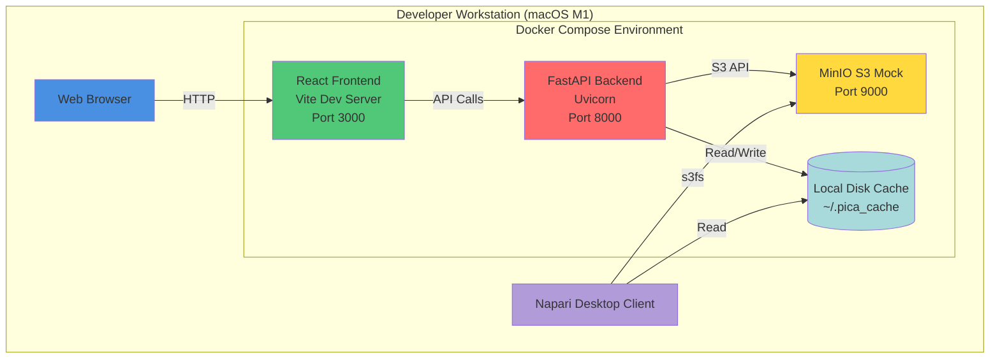
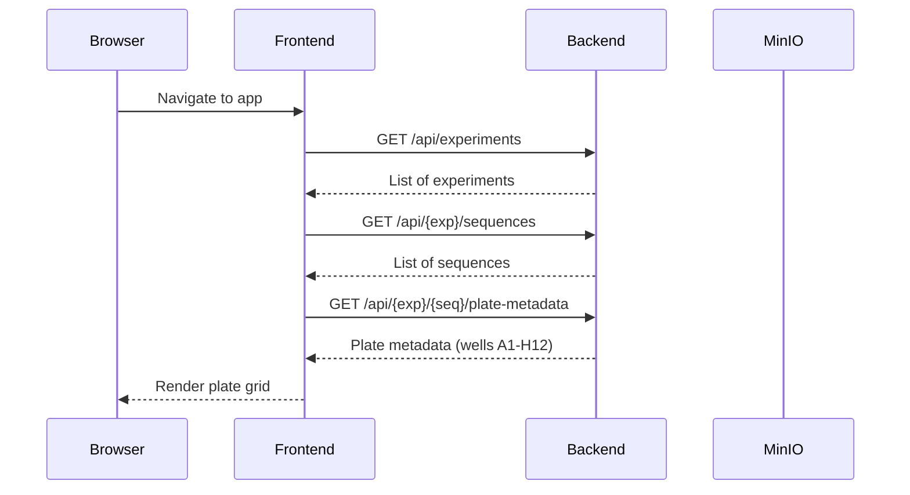
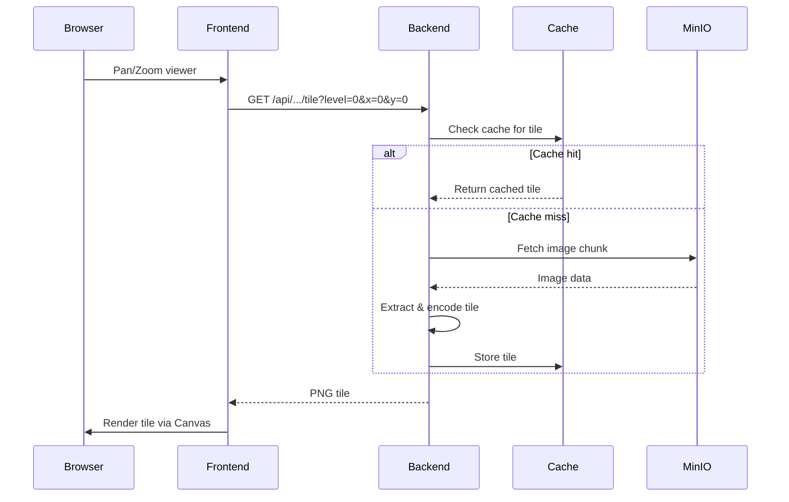
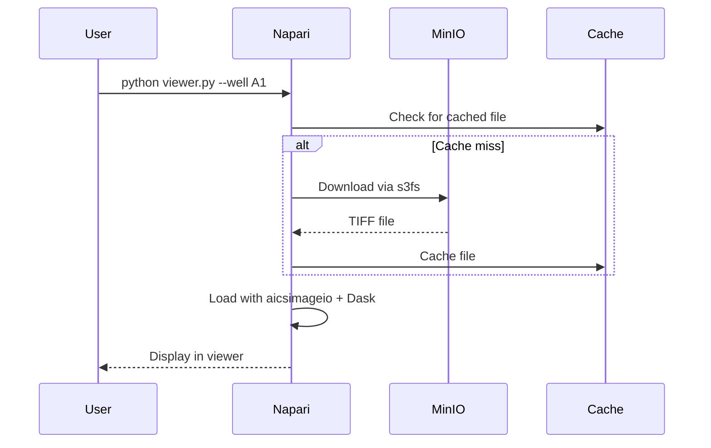
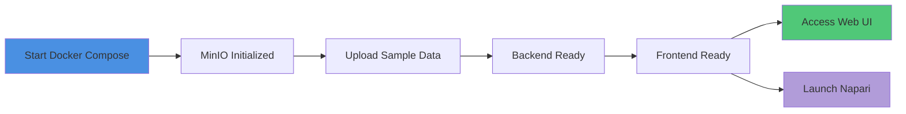

# PICA Microscopy Viewer - Local Development Architecture

This document describes the architecture for local development on macOS (M1) using Docker Desktop.

## High-Level Architecture



## Component Details

### Web Browser
- **Purpose**: User interface for plate browsing and image viewing
- **Technology**: Modern web browser (Chrome, Safari, Firefox)
- **Port**: Accesses frontend on `http://localhost:3000`

### React Frontend
- **Purpose**: Web UI for plate selection and image visualization
- **Technology**:
  - React 18+ with TypeScript
  - Vite for dev server and bundling
  - WebGL-based image renderer
  - TailwindCSS for styling
- **Features**:
  - Plate grid browser (A1-H12)
  - Multi-channel viewer with opacity controls
  - Composite view with RGB mapping
  - Mask overlay support
  - Pan and zoom with tile streaming
- **Port**: 3000
- **Volume Mounts**:
  - `./frontend:/app` (hot reload)
  - `/app/node_modules` (preserved)

### FastAPI Backend
- **Purpose**: API server for metadata and tile serving
- **Technology**:
  - FastAPI with async endpoints
  - Uvicorn ASGI server
  - Python 3.11+
- **Features**:
  - Tile serving with multi-scale support
  - Composite generation
  - Metadata endpoints
  - Cache management
  - S3 integration via s3fs
- **Port**: 8000
- **Volume Mounts**:
  - `./backend:/app` (hot reload)
  - `backend_cache:/app/cache` (persistent cache)
  - `./config.yaml:/app/config.yaml` (config)

### MinIO (S3 Mock)
- **Purpose**: S3-compatible object storage for local development
- **Technology**: MinIO server
- **Features**:
  - S3 API compatibility
  - Web console on port 9001
  - Bucket: `pb-ome-tiffs`
  - Sample data upload via script
- **Ports**:
  - 9000 (S3 API)
  - 9001 (Web Console)
- **Credentials**:
  - Access Key: `minioadmin`
  - Secret Key: `minioadmin`
- **Volume**: `minio_data` (persistent storage)

### Local Disk Cache
- **Purpose**: LRU cache for tiles and image chunks
- **Technology**: diskcache (Python)
- **Location**:
  - In Docker: `/app/cache`
  - On Host: Docker volume `backend_cache`
  - For napari: `~/.pica_cache` on host
- **Size**: Configurable (default 10 GB for dev)
- **Eviction**: Least Recently Used (LRU)

### Napari Desktop Client
- **Purpose**: Native desktop viewer for direct image inspection
- **Technology**:
  - napari (Qt-based viewer)
  - napari-aicsimageio
  - napari-ome-zarr
  - Dask for lazy loading
- **Features**:
  - Full-resolution viewing
  - Multi-channel support
  - Mask overlays
  - Direct S3 access via s3fs
  - Can read from local cache
- **Deployment**: Runs natively on macOS (outside Docker)

## Data Flow

### 1. Plate Browsing Flow


### 2. Tile Loading Flow


### 3. Napari Direct Access Flow


## Network Configuration

All services communicate via Docker bridge network `pica-network`:
- Services resolve each other by name (e.g., `http://backend:8000`)
- Ports are exposed to host for external access
- MinIO uses internal URL for backend: `http://minio:9000`

## Configuration Management

Configuration is managed through:
1. **config.yaml**: Main configuration file (mounted read-only)
2. **Environment variables**: Override config values
3. **.env file**: Local environment-specific settings

Priority: Environment Variables > config.yaml > Defaults

## Development Workflow



### Commands:
```bash
# Start all services
docker-compose up -d

# Upload sample data to MinIO
pip install boto3 tifffile
python scripts/upload_sample_data.py

# Access web UI
open http://localhost:3000

# Access MinIO console
open http://localhost:9001

# Launch napari viewer
cd napari_client
pip install -r requirements.txt
python viewer.py --experiment exp001 --sequence seq001 --well A1

# View logs
docker-compose logs -f backend
docker-compose logs -f frontend

# Stop services
docker-compose down
```

## Hot Reload Support

- **Backend**: Code changes auto-reload via uvicorn `--reload`
- **Frontend**: Vite HMR (Hot Module Replacement)
- **Config**: Requires service restart to pick up changes

## Storage Paths

| Component | Container Path | Host Path | Purpose |
|-----------|---------------|-----------|---------|
| Backend code | `/app` | `./backend` | Source code (mounted) |
| Frontend code | `/app` | `./frontend` | Source code (mounted) |
| Backend cache | `/app/cache` | Docker volume | Tile cache |
| MinIO data | `/data` | Docker volume | S3 storage |
| Config | `/app/config.yaml` | `./config.yaml` | Configuration |
| Napari cache | N/A | `~/.pica_cache` | Desktop client cache |

## Security Notes (Local Dev)

- No authentication enabled (ENABLE_AUTH=false)
- MinIO uses default credentials (change for production)
- CORS allows all origins
- S3 uses HTTP (not HTTPS)
- All services accessible from localhost

## Limitations

- Designed for single developer use
- No horizontal scaling
- Limited by local machine resources
- No SSL/TLS encryption
- Sample data only (not production data)
